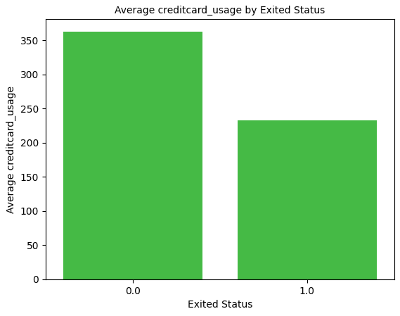
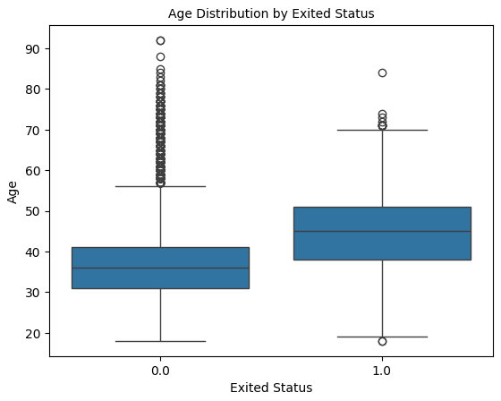
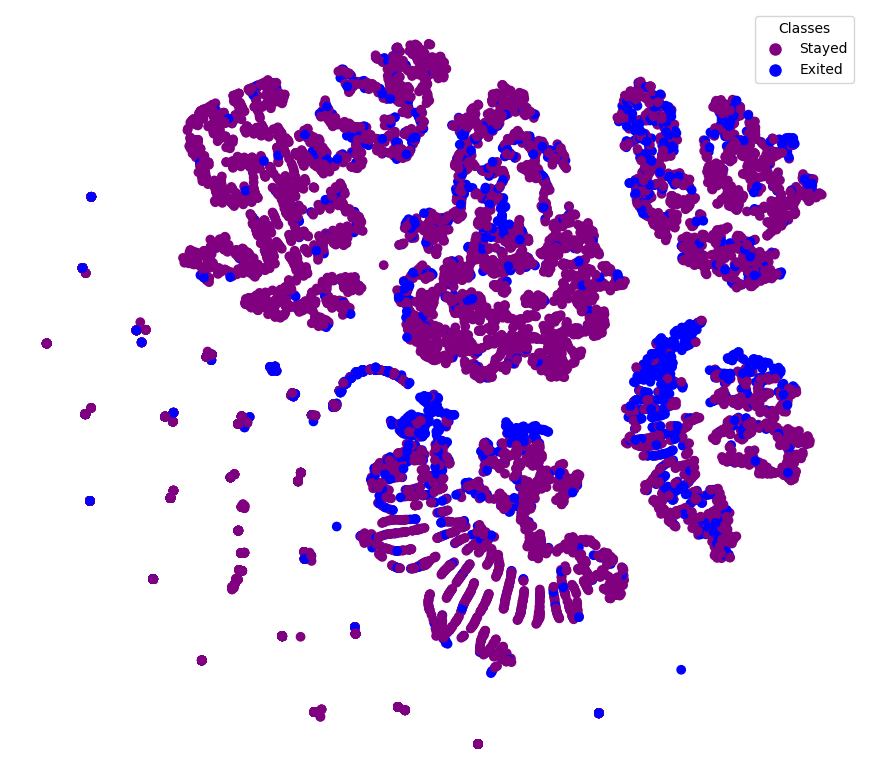
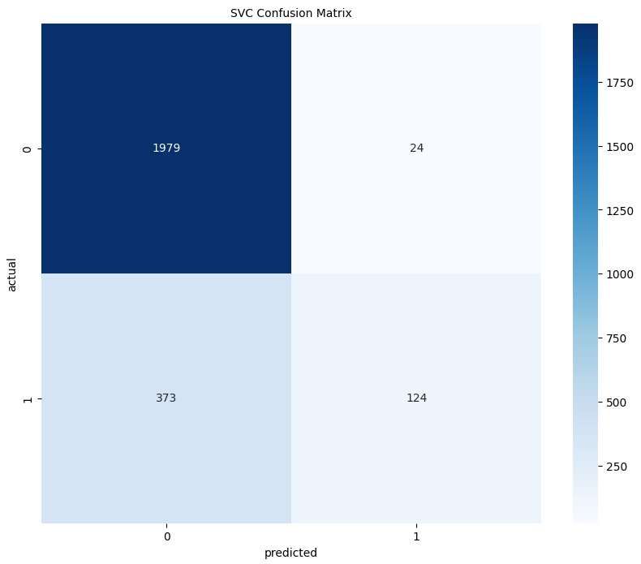
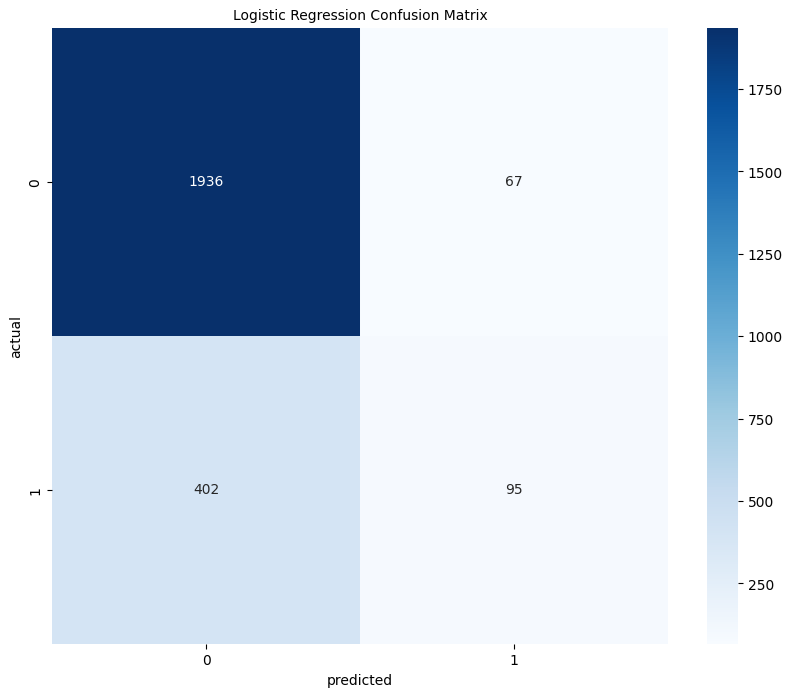
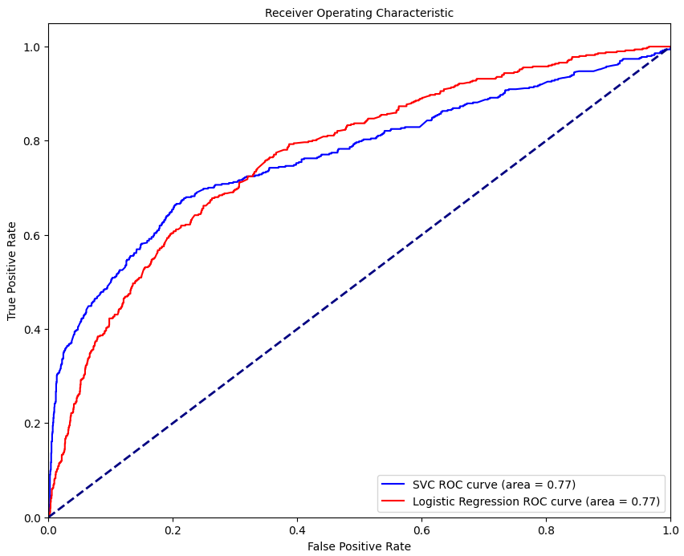

# Customer Churn Dataset Analysis
#### by Jesse Coulson

## Purpose
This project analyzes a customer churn dataset for a bank to identify factors influencing customer retention. We perform exploratory data analysis, feature engineering, and model building to predict customer churn. The aim is to provide insights to the bank for improving customer retention strategies.

## Usage
Open and view the `customer_churn_classification.ipynb` Jupyter Notebook to follow the entire project workflow from data preprocessing to model evaluation. The notebook contains detailed explanations and code for each step.

## Visuals
### Example visuals from EDA

#### TSNE Visualization of Features

### Results visuals

## Conclusion
The Support Vector Classifier (SVC) model performed better than the Logistic Regression model. Key metrics such as accuracy, precision, recall, and F1-score are documented in the notebook. The SVC model provides higher accuracy and precision, making it a better choice for the bank's retention strategy. For detailed analysis and more view `customer_churn.ipynb`.
